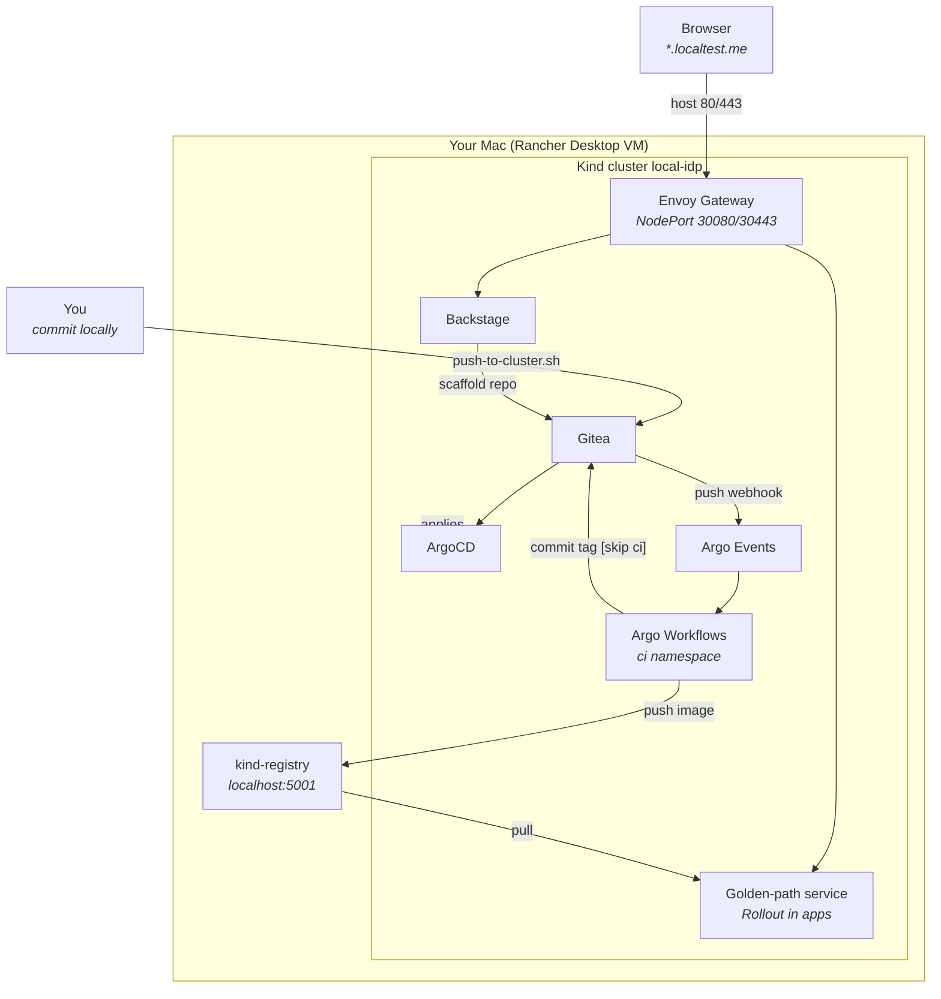

# Architecture

The settled decisions. `decisions.md` holds the dated log of how they were reached.

## The two paths that matter

The left path is how every change reaches the cluster: through Git and ArgoCD, never through
`kubectl`. The golden path is the same path driven by a machine: the CI pipeline's only way to deploy
is to commit a new image tag and let ArgoCD do the rest.

## Cluster

Kind v0.33.0, Kubernetes 1.36, node image pinned by digest. One control plane (labelled
`ingress-ready=true`, holding host ports 80 and 443) and two workers. Kubeconfig at
`~/.kube/local-idp`, context `kind-local-idp`, so nothing touches `~/.kube/config`.

## Registry

A `registry:3.1.2` container named `kind-registry`, outside the cluster and on the `kind` Docker
network. Three names for one registry:

| From | Address | Why |
|---|---|---|
| Your Mac | `localhost:5001` | Published port |
| Node containerd | `localhost:5001` | `hosts.toml` in `/etc/containerd/certs.d` maps it to `http://kind-registry:5000` |
| A pod | `kind-registry:5000` | Docker DNS on the `kind` network |

Manifests reference `localhost:5001/...`. The CI build pushes to `kind-registry:5000/...`.

## Ingress

Gateway API through Envoy Gateway. ingress-nginx is end of life. Kind has no load balancer, so the
`EnvoyProxy` resource makes the data plane a NodePort pinned to 30080 and 30443, and the Kind config
maps host 80 and 443 onto those. One Gateway, `platform-gateway`, with an HTTP listener that only
redirects and an HTTPS listener for `*.localtest.me`. `localtest.me` and all its subdomains resolve
to 127.0.0.1 in public DNS, so no `/etc/hosts` edits are needed.

## TLS

cert-manager generates a root CA inside the cluster, and the `local-idp-ca` ClusterIssuer signs one
wildcard certificate for the Gateway. `provision/trust-ca.sh` exports the root for your keychain.
Every backend behind the Gateway speaks plain HTTP, including ArgoCD (`server.insecure`).

## GitOps

ArgoCD 3.x, installed by Helm as the one bootstrap exception. One App-of-Apps per plane:
`platform-foundation` and `platform-self-service`. Sync waves order the foundation, and an
`argoproj.io_Application` health check makes each wave wait for the previous one to be Healthy.

The platform source is either the in-cluster Gitea (the default, fully offline after the first chart
pulls) or a GitHub repo. `provision/set-git-source.sh` rewrites every Git-sourced `repoURL` and the
Backstage catalog base together, and commits the change. Gitea runs in both modes because the
golden-path service repos live there.

## Secrets

OpenBao in dev mode, External Secrets Operator pulling through a `ClusterSecretStore`. The Backstage
Postgres password is generated in the cluster by the OpenBao seed Job and reaches Postgres and
Backstage only through an ExternalSecret.

## Policy

Kyverno, every rule scoped to namespaces labelled `local-idp.dev/policy=enforce` (only `apps`). Two
sets: the foundation `policy-baseline` (Audit, permanently) and `golden-path-policies` (Audit until
phase 7, then Enforce).

## Observability

kube-prometheus-stack selecting every ServiceMonitor; Loki (SingleBinary) fed by Alloy; Tempo fed by
the OpenTelemetry Collector. Grafana has all three as datasources.

## The golden path

Backstage template, Gitea `services` org, org-level push webhook, Argo Events Sensor, Argo Workflows
pipeline (vet, test, rootless BuildKit, tag commit), ApplicationSet with a Gitea SCM generator,
bounded by the `golden-path-services` AppProject. Services run as a replica-weighted canary Rollout,
scaled by KEDA on a Prometheus query.
